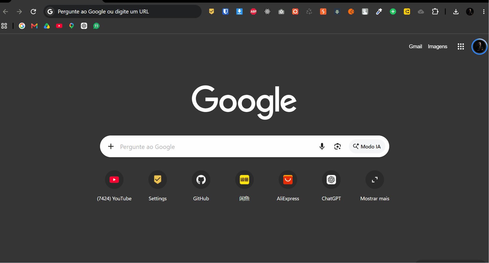

# KeeprSync

Google Chrome extension for managing, organizing, and synchronizing bookmarks across different computers.

> Early version focused on bookmark synchronization through Google Drive.

## Overview

KeeprSync keeps the Chrome Bookmarks bar synchronized between computers by using a JSON file stored in the user's Google Drive.

## Demo



## Goals

- Synchronize the Chrome Bookmarks bar between computers.
- Preserve folder organization and bookmark order during synchronization.
- Detect deletions after an initial synchronization snapshot.
- Support manual and background synchronization.
- Clearly display synchronization status and errors.
- Protect imported data and OAuth tokens.

## Implemented features

### Popup

- Displays the number of local bookmarks.
- Shows the current synchronization state.
- Provides a manual **Sync bookmarks** action.
- Opens the settings page.

### Google Drive settings

- Connects and disconnects a Google account.
- Creates the `KeeprSync` folder when needed.
- Creates a JSON bookmark file inside that folder.
- Lists JSON files stored in the `KeeprSync` folder.
- Automatically selects the only available file.
- Allows the user to choose a different file.
- Configures automatic synchronization intervals.

### Synchronization

- Synchronizes the Chrome Bookmarks bar with the selected Drive JSON file.
- Synchronizes bookmark and folder order, including nested folders.
- Preserves nested folders and folder organization.
- Merges bookmarks by URL and folders by their complete path.
- Propagates deletions after a successful baseline snapshot.
- Imports Drive bookmarks on first use when the local bar is empty.
- Uploads local bookmarks on first use when the Drive file is empty.
- Preserves a generated `faviconUrl` in the JSON metadata.
- Saves the Drive document before changing the local bookmark tree.
- Shows Chrome notifications for automatic synchronization results.

## Current synchronization behavior

The synchronization service follows this process:

1. Read the Chrome Bookmarks bar and the selected Drive JSON file.
2. Use the previous local snapshot to identify deletions.
3. Merge new bookmarks and folders while resolving order changes from the local and remote snapshots.
4. Write the merged document to Drive.
5. Rebuild the local Bookmarks bar only after the Drive write succeeds.
6. Save a new local snapshot and synchronization timestamp.

If there is no previous snapshot:

- An empty local bar imports the Drive bookmarks.
- An empty Drive file receives the local bookmarks.
- If both sides contain data, additions are merged without interpreting missing data as deletion.

## Architecture

The extension is organized into the following layers:

- **Popup:** status display and manual synchronization command.
- **Options page:** Google Drive connection, file selection, and automatic sync settings.
- **Sync service:** shared Drive access, validation, merge, deletion detection, and Chrome bookmark updates.
- **Service worker:** background alarms, synchronization lock, notifications, and message handling.
- **Local storage:** selected Drive file ID, sync snapshot, timestamp, and automatic sync preferences.

Manual and automatic synchronization use the same `sync-service.js` module.

## Google Drive integration

The settings page includes a Google Drive flow that allows the user to:

- Connect a Google account.
- Disconnect Google Drive without deleting files from Drive.
- Create the `KeeprSync` folder in Google Drive when needed.
- Create a new `keeprsync-bookmarks.json` file in Drive.
- Select an existing KeeprSync JSON file from Drive.
- Automatically use the only available JSON file when there is just one.
- Store the selected Drive file ID locally for future synchronization.
- Synchronize the Chrome Bookmarks bar with the selected Drive JSON file.
- Show an `Up to date` status flag after a successful manual synchronization.
- Enable or disable automatic synchronization.
- Choose an automatic synchronization interval of 5 seconds for testing, or 5, 10, 15, or 30 minutes. Chrome applies a minimum alarm interval, so the 5-second option is best effort and may run at 30 seconds.
- Receive a Chrome notification after each automatic synchronization attempt.

Before using the connection button, configure OAuth in Google Cloud:

1. Create or select a project in the [Google Cloud Console](https://console.cloud.google.com/).
2. Enable the Google Drive API.
3. Configure the OAuth consent screen.
4. Create an OAuth client for a Chrome extension and copy its Client ID.
5. Create an OAuth client specifically for a Chrome extension and associate it with the extension ID shown in `chrome://extensions` or `brave://extensions`.
6. Set the generated Client ID in the `oauth2.client_id` field of `manifest.json`.
7. Reload KeeprSync from the browser's extensions page.

The extension requests the limited `drive.file` scope, which restricts access to files created or opened by KeeprSync. On the first synchronization, if the Chrome Bookmarks bar is empty, KeeprSync imports the Drive file without treating the empty local bar as a deletion. If the Drive file is empty, it uploads the local bar. After the first successful synchronization, KeeprSync stores a local snapshot so a deletion made on either side can be propagated to the other side on the next synchronization.

Bookmark records also preserve a `faviconUrl` based on each URL. Chrome controls the actual favicon cache displayed in the bookmarks bar, while this metadata keeps the icon reference available in the synchronized JSON.

## Drive file format

KeeprSync stores the bookmark tree in a JSON file similar to this:

```json
{
  "version": 1,
  "updatedAt": "2026-09-13T12:00:00.000Z",
  "bookmarks": [
    {
      "title": "Chrome documentation",
      "url": "https://developer.chrome.com/docs/extensions/",
      "faviconUrl": "https://www.google.com/s2/favicons?sz=32&domain_url=https%3A%2F%2Fdeveloper.chrome.com"
    },
    {
      "title": "Work",
      "children": []
    }
  ]
}
```

The local `lastSyncedBookmarks` snapshot is kept in `chrome.storage.local` and is used to detect deletions on later synchronizations.

## Technologies

- Chrome Extensions Manifest V3.
- JavaScript or TypeScript.
- API `chrome.bookmarks`.
- `chrome.storage` for settings and synchronization snapshots.
- `chrome.identity` for Google OAuth.
- Google Drive API v3.
- `chrome.alarms` for background scheduling.
- `chrome.notifications` for automatic sync feedback.

The extension currently has no separate backend.

## Security and privacy

- Request only the permissions that are necessary.
- Explain to users why bookmark permission is required.
- Use HTTPS for all communication with Google APIs.
- Never store credentials in plain text.
- Protect synchronized data at rest and in transit.
- Allow a computer to be disconnected remotely.
- Define a clear data storage and deletion policy.
- Validate Drive bookmark JSON before importing it into Chrome.
- Accept only HTTPS bookmark URLs from synchronized files.
- Limit imported tree depth, node count, title length, and URL length.
- Restrict API requests to the expected Google HTTPS endpoints.
- Clear cached and in-memory OAuth tokens when disconnecting.

## Current structure

```text
.
├── manifest.json
├── icons/
│   └── icon128.png
└── src/
  ├── background.js
  ├── options.css
  ├── options.html
  ├── options.js
  ├── popup.css
  ├── popup.html
  ├── popup.js
  └── sync-service.js
```

The manifest uses Manifest V3, registers a service worker, and requests the `bookmarks`, `storage`, `identity`, `alarms`, and `notifications` permissions. The popup displays the local bookmark count and sends manual synchronization requests to the shared service worker. The same service worker can synchronize the Chrome Bookmarks bar automatically in the background.

## Local development

Since the extension currently has no build process, it can be loaded directly into Chrome:

```bash
# no build command is required at this stage
```

To load the extension manually in Chrome:

1. Open `chrome://extensions`.
2. Enable **Developer mode**.
3. Click **Load unpacked**.
4. Select the project folder containing `manifest.json`.

## Creating a release

Run the release script from the project root:

```powershell
.\build-release.ps1
```

The script validates the required extension files and creates a package in `target/`:

```text
target/
└── KeeprSync-v0.1.0.zip
```

The ZIP contains only `manifest.json`, `icons/`, and `src/`, with `manifest.json` at the package root. It does not include the README, development files, or OAuth secret files.

## Current limitations

- There is no bookmark CRUD editor inside the KeeprSync popup.
- The popup does not list individual bookmark records.
- Advanced conflict resolution is not implemented; the merge is based on URL and folder path.
- The synchronization snapshot is stored locally in `chrome.storage.local`.
- Chrome may enforce a minimum interval for the 5-second test alarm.
- The favicon reference is stored in JSON, but Chrome controls the visual favicon cache.
- Automated tests and a build pipeline have not been added yet.

## Contributing

Contributions are welcome. Before opening a pull request:

1. Create a branch for the change.
2. Add or update the related tests.
3. Run the project checks.
4. Clearly describe the problem and proposed solution.

## License

The project license has not been defined yet.
